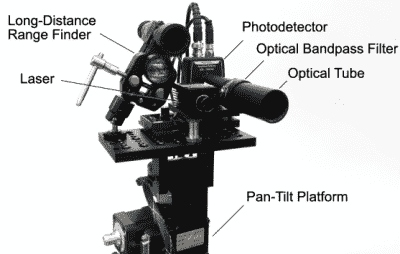

# 有了足够大的激光，世界就是你的传感器

> 原文：<https://hackaday.com/2021/05/21/with-a-big-enough-laser-the-world-is-your-sensor/>

用我们迟钝的人类感官很难分辨，但我们周围的一切都在振动。当然，与电线杆或邮箱相比，让桥梁和房屋等大型物体发出嗡嗡声需要更多的能量，但毫无疑问，它们都有一点嗡嗡声。有了他们新的自动化激光器，VibroSight++背后的团队相信他们可以利用这一事实[使城市规模的传感比以往任何时候都更加便宜和容易](https://chrisharrison.net/index.php/Research/VibrosightPlusPlus)。

该系统的关键是安装在炮塔上的 3B 级红外激光器和光电探测器，它们可以系统地扫描和识别可视范围内的反射表面。现在你可能会认为这样的设置不会从城市景观中获得太多的信号，但碰巧的是，普通的城市街区都挤满了回射器。从街道标志到路标和车牌，该团队估计密集的城市地区每平方公里大约有 7000 个反射器。在这些现有数据点的基础上，额外的反射器可以很容易地添加到城市规划者可能想要监控的特别有趣的设备上。

 一旦 VibroSight++识别出目标，下一步就是将激光从目标上弹开，并检测反射器振动引起的返回信号的微小扰动。在下面的视频中，您可以看到这一基本概念如何在现场得到实际应用，从计算某段道路上有多少辆车通过，到查看特定邮箱的受欢迎程度。外面有一整个世界的信息等着我们去收集，除了偶尔一块反光带之外，不需要安装任何更奇特的东西。

如果这项技术看起来奇怪地熟悉，那可能是因为我们报道了团队早期的工作，这些工作专注于(没有双关语)在 2018 年使用反射激光束实现家庭自动化。当时，他们将小得多的激光瞄准搅拌机和冰箱，而不是牌照和街道标志，但概念在其他方面是相同的。虽然我们承认[技术确实散发出独特的奥威尔式氛围](https://hackaday.com/2015/12/08/theremins-bug/)，但很难不被团队升级的硬件和软件提供的“大数据”可能性所吸引[。](https://hackaday.com/2015/05/18/ask-hackaday-the-internet-of-things-and-the-coming-age-of-big-data/)

 [https://www.youtube.com/embed/jcXpEXoanJE?version=3&rel=1&showsearch=0&showinfo=1&iv_load_policy=1&fs=1&hl=en-US&autohide=2&wmode=transparent](https://www.youtube.com/embed/jcXpEXoanJE?version=3&rel=1&showsearch=0&showinfo=1&iv_load_policy=1&fs=1&hl=en-US&autohide=2&wmode=transparent)

