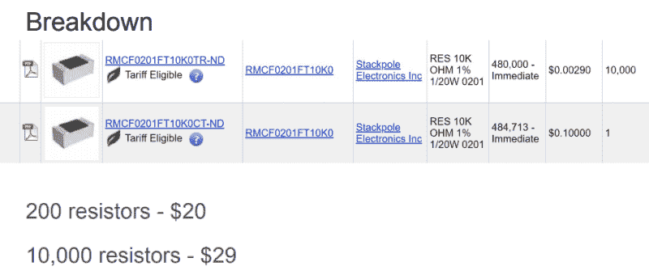
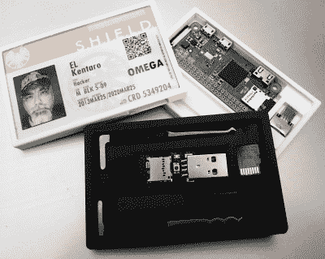
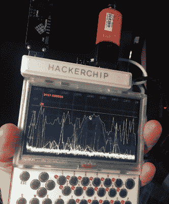

# WOPR:打造值得分享的硬件

> 原文：<https://hackaday.com/2019/04/04/wopr-building-hardware-worth-sharing/>

不难想象，任何经常阅读 Hackaday 的人至少已经进步到可以将 LED 连接到微控制器上，让它闪烁而不会让任何东西着火。我们甚至不会责备你没有用 555 定时器做这件事。也可以毫不夸张地说，如果你能成功地将现代电子产品的“Hello World”组装在一块试验板上，你就能在那个微控制器上再添加几个 led、一些传感器和几个按钮，并生产出可能危险地接近有用的小工具的东西。硬件黑客就这样悄悄靠近你。

这就变得棘手了:我们中有多少人还停留在那个点上？别害羞，这没什么丢人的。为这些页面增色的“已完成”项目中的很大一部分仍在试验板上，如果我们不得不放弃每一个仍以 Arduino 或 Wemos D1 为核心的全面开发板的项目……嗯，我们只能说它不会很漂亮。

当然，如果你只是在做个人项目，安装 PCB 或定制外壳通常没什么好处。但是当你想要建立多个的时候会发生什么呢？如果你有一个值得付诸实施的想法，你就必须用更多的技巧来处理这个问题。尤其是如果你想从投资中获利的话。

[在最近于大西洋城举行的 WOPR 峰会](https://hackaday.com/2019/03/21/first-wopr-summit-finds-the-winning-move/)上，有两个演讲专门讨论如何将您的硬件设计提升到一个新的水平。Russell Handorf 和 Mike Kershaw 主持了一个长达四小时的研讨会，名为*你的项目战略:概念到原型*，El 健太郎做了一个精彩的演讲，讲述了他的设计过程，名为*是问:设计黑客小工具*，它共同解决了为比你自己更多的观众构建硬件的实践和更多哲学方面的问题。

## 主动使用组件

 在 [*项目战略的开始:概念到原型*](https://www.woprsummit.org/workshops) ，有一点非常明确:你不需要成为专业工程师来设计适合制造的硬件。网上以教程或 YouTube 视频的形式提供了如此丰富的信息，以至于学习基础知识比以往任何时候都要容易。在 Hackaday 上查看最新的项目和技术已经是一个好的开始。最重要的是从简单开始，然后一步一步来。

在研讨会期间， [WOPR 峰会徽章本身经常被用作范例](https://handorf.org/projects/2019/02/13/WOPR.html)。其相对简单的设计、较低的零件数量以及通孔和表面贴装结构的结合，让与会者近距离地亲身体验了一个入门级项目，他们应该能够轻松完成该项目。把这个方便的参考点挂在每个观众的脖子上不是偶然的；Russell 和 Mike 是 WOPR 峰会的官方“证章人员”,所以他们确实有一些内部消息。

在整个研讨会中，两人轮流在讲台上谈论，嗯，*一切*。从阅读数据手册到采购元件，Mike 和 Russell 对这一切都有自己的看法。我们花了很多时间讨论电子元件的不同外形，以及每种外形的优缺点。如果你只是为了自己的目的而构建，你可以做你想做的，但如果你想把设计投入生产，你真的需要咬紧牙关，适应表面贴装。

在你知道你将使用哪种零件后，你需要找到它们。在这里，两人再次从他们构建硬件小工具的综合经验中提供了一些指导。虽然你能找到的 led 和电阻等“软糖”零件的最低价格通常不错，但他们警告说，不要对更高级的组件有类似的购物习惯。坚持使用像 Digikey、Mouser、Element14 这样有信誉的分销商，不要购买任何看起来远低于市场价值的东西。随着[市场上假冒或回收零件的盛行](http://hackaday.com/2017/12/27/a-guidebook-to-the-world-of-counterfeit-parts/)，尤其是在与海外供应商打交道时，不值得仅仅为了节省几美元而冒险。也就是说，购买比你实际需要的数量更多的零件通常会便宜很多，所以如果价格合适的话，不要害怕在“数量”栏加几个零。

研讨会的另一个要点是，你不应该害怕使用交钥匙模块，而不是试图重新发明轮子。不，这并不意味着在你的商业产品中留下一个 Arduino。但是，不要试图开发自己的 WiFi 模块或 LiPo 充电器电路，利用这样一个事实，即有人已经为你做了艰苦的工作。你不会建立一个比 ESP8266 更好的 WiFi 模块，所以不要浪费时间去尝试；只需设计带有焊盘的 PCB，以便可以焊接模块。[我们甚至不时在商业产品中看到这一点](http://hackaday.com/2019/02/27/teardown-applights-personalized-projection/)。诚然，模块通常是更昂贵的路线，制造公司不喜欢它们，因为它们会使设计更难组装，但成本的增加是值得的，以保持你的理智。

## 黑我的间谍

 就硬件而言，*问:设计黑客工具*相当独特。几乎没有提到实际的电子元件，也没有看到烙铁。但它确实引用了弗兰克·劳埃德·赖特的话，还有一份罗伯特·华莱士的间谍小说*。从一开始，埃尔·健太郎就承诺对硬件设计进行独特的审视，他确实做到了。*

 *他的整个演讲都是基于两个核心概念:一个设备的设计应该完全按照用户的需求去做，而且在做的时候应该看起来尽可能的酷。埃尔·健太郎总是从詹姆斯·邦德电影中使用的小玩意中获得灵感；这些硬件不仅似乎完全适合这位温文尔雅的特工当时所执行的任务，而且还设法营造出一种可以与 007 本人相媲美的风格和复杂程度。

 这些原则[启发他创造了像“黑客通行证案”](https://medium.com/@elkentaro/hacker-pass-case-7e6d3e14170a)这样的东西，这是一个 3D 打印套件，旨在容纳一个树莓派零，一套开锁工具，以及 21 世纪间谍可能需要的其他各种各样的东西。事实上，他在演示期间展示的许多设计都可以合理地描述为智能 3D 打印外壳中的现成组件。他回忆起一个特别有趣的项目，其中一名*异常专注的安全研究员要求他设计一个印刷外壳，允许他们将一个树莓派 Zero 偷偷带进一个设施，在那里他们将被彻底搜查。可视化这样一个设备的机制将作为一个练习留给读者，但我们只能说这是一件好事，圆周率零点是如此之小。*

虽然谈话主要集中在他设计的小工具的外观和感觉上，但埃尔·健太郎确实有一些反映迈克和拉塞尔当天早些时候所说的智慧之言。也就是说，在采购组件时要非常小心。他向与会者讲述了他的黑客项目，该项目旨在将 9 美元的小型 Linux 电脑变成一个移动渗透测试工具包。这个项目越来越受欢迎，但 Hackaday 的读者无疑会记得，[生产 C.H.I.P .的公司倒闭了，二手市场上的电脑价格飞涨。现在他说，他计划向公众发布的设计不会使用任何不能从亚马逊上获得的东西。](https://hackaday.com/2018/04/03/is-this-the-end-for-the-c-h-i-p/)

## 来自前线的故事

这是他们的第一年，WOPR 峰会没有任何录音设备。这总是令人遗憾的，因为没有什么可以替代看到这些人谈论他们真正感兴趣的话题。虽然公平地说，一个四小时的研讨会不会特别好地翻译到 YouTube 上。

为此，任何想要认真建造令人惊叹的东西的人都应该亲自参加这类活动。即使你所在的地区没有黑客或硬件设计惯例，看看在合理的距离内是否至少有一个黑客空间。的确，互联网包含了几乎所有可以想象的主题的大量信息，但有时走出你的舒适区，与一些人面对面交流是值得的。你可能会对你学到的东西感到惊讶，或者对你教的东西感到惊讶。*