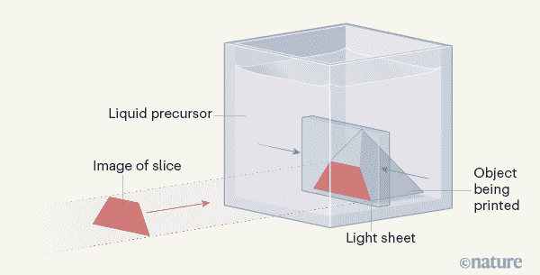

# Xolography:一种提高体积 3D 打印精度的方法

> 原文：<https://hackaday.com/2021/01/04/xolography-a-method-to-improve-the-accuracy-of-volumetric-3d-printing/>

在过去的几年里，增材制造(AM)已经成为黑客和制造商的常用工具，首先是 FDM，现在是 SLA 3D 打印机变得大众负担得起。虽然这些机器非常有用，但它们利用缓慢的逐层方法来生产物体。一种相对较新的技术被称为体积添加制造(VAM)，它有望通过一次打印整个物体来改变这一切，[根据《自然》杂志最近的一篇文章](https://www.nature.com/articles/d41586-020-03543-3)，它刚刚获得了很大的分辨率提升。

这个概念类似于 SLA 印刷，但不是通过将当前层的 2D 图像投影到容器中来固化树脂， [VAM 使用多束激光在液体中创建交叉点](https://phys.org/news/2017-12-volumetric-d.html)。将树脂暴露在这个投影下几秒钟后，3D 模型就一次完成了。这不仅快得多，而且消除了对支撑材料的需要，甚至传统的构建板也是不必要的。

Visualization of the dual-color printing process as used by Regehly et al. (Credit: Nature)

到目前为止，VAM 的分辨率和最大物体尺寸还有很多需要改进的地方，但在 Regehly 等人的这项新研究中，他们声称已经实现了“高达 25 微米”的特征分辨率和“高达 55 厘米³/秒”的固化速率。他们使用了两种不同波长的交叉激光束，一种形成“光幕”(图中的蓝色)，另一种光束(红色)将幻灯片投影到这个光幕上。他们将这种技术称为“全息照相术”，是“全息”(希腊语中“整体”的意思)和交叉激光束形成的“X”形的结合。

实现这一工作的关键是树脂的化学性质:第一种波长激发溶解在树脂中的称为 DCPI(双色光引发剂)的分子。当第二波长撞击相同的分子时，引发树脂聚合过程。页面顶部的图片是一张试印品；在传统的 3D 打印机上制作这样的设计需要大量难以去除的支撑材料。

虽然这显然不是一个技术爱好者会用它来取代他们的 FDM 和 SLA 打印机，但仍然有许多公司和机构在研究各种 VAM 技术和方法。随着越来越多的[复杂性和挑战](https://www.fabbaloo.com/blog/2020/3/5/volumetric-3d-printing-is-far-more-complex-than-you-imagine)被处理，谁知道 VAM 什么时候会成为至少一些 SLA 应用的可行替代品？

感谢[Qes]的提示。