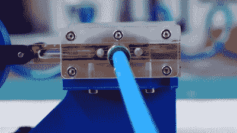

# 你可以 3D 打印一个工作的往复式蒸汽机

> 原文：<https://hackaday.com/2021/12/22/you-can-3d-print-a-working-reciprocating-steam-engine/>

3D 打印通常不以其耐热性著称。然而，[Integza]指出，使用正确的技术，可以 3D 打印能够处理蒸汽热而不会失败的零件。因此，从那里开始的自然发展就是建造活塞式蒸汽机。

The sliding valve alternately feeds steam to each side of the piston.

树脂打印在这里很关键，因为这种零件的熔点比典型的 FDM 打印机打印出来的要高得多。试着用 PLA 做同样的热部件，你很快就会得到一堆熔化的粘性物质。

为了使这样的发动机工作，阀门需要允许蒸汽流入活塞的交替侧，让它连续往复运动。使用一个简单的滑阀，当由连接到发动机输出轴的飞轮上的一个臂驱动时，允许蒸汽交替地流向活塞的一侧和另一侧。

用压缩空气和蒸汽测试后，发动机连续运转，热情地突突前进。然而，蒸汽性能受到了[Integza]高压锅仅 1.5 巴低压输出的影响。同样，炊具的蒸汽容量也很低，所以引擎只运转了 15 秒钟。

然而，它表明，有了更好的蒸汽供应，印刷蒸汽船确实可以运行一段时间。不过，如果你不喜欢潮湿的发动机，可以考虑挤压一个斯特林发动机来代替 T1。休息后的视频。

 [https://www.youtube.com/embed/DmOL2oB1d6w?version=3&rel=1&showsearch=0&showinfo=1&iv_load_policy=1&fs=1&hl=en-US&autohide=2&wmode=transparent](https://www.youtube.com/embed/DmOL2oB1d6w?version=3&rel=1&showsearch=0&showinfo=1&iv_load_policy=1&fs=1&hl=en-US&autohide=2&wmode=transparent)

