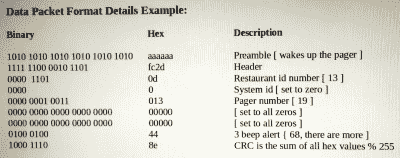

# 你的桌子已经准备好了，感谢 HackRF

> 原文：<https://hackaday.com/2019/06/04/your-table-is-ready-courtesy-of-hackrf/>

你有没有发现自己周六晚上在拥挤的餐馆里，手里拿着一个当轮到你入座时会闪烁和振动的小玩意儿？下一次，拿出 HackRF，[跟随[Tony Tiger],他将展示如何使用 HackRF 轻松解雇他们](https://www.youtube.com/watch?v=ycLLb4eVZpI)。当然，不会有*实际上*当你得意洋洋地向工作人员展示你那闪烁的呼机时，一张桌子已经准备好了；但是特别提款权能做的也就这么多了。

 即使你不想在你最喜欢的餐厅排队，但[Tony]整理的视频是一个使用软件定义无线电(SDR)来检查并最终复制无线通信协议的优秀实践示例。这里演示的相同技术可以应用于野外的任何数量的设备，几乎不需要修改。假设这些“餐馆寻呼机”一开始就不是高安全性的设备，但是你会~~震惊~~惊讶有这么多其他设备对安全采取类似的漫不经心的态度。

[Tony]首先使用 inspectrum 来检查 467.750 Mhz 设备使用的频移键控(FSK)调制，然后使用 Universal Radio Hacker 来捕获空中发送的实际二进制数据。通过研究传输和他在网上找到的信息，他最终能够拼凑出餐馆基站使用的数据包结构。

最后，他写了一个 Python 脚本，可以根据他想要启动的寻呼机生成数据包。如果他觉得特别淘气，他甚至可以一次把它们都引爆。该脚本输出一个二进制文件，然后加载到 GNU Radio，通过 HackRF 进行传输。[Tony]说他还没有完全准备好发布他的脚本，但他在视频中提供了足够的信息，无畏的黑客可能会在他将它发布到 GitHub 时发布并运行他们自己的版本。

我们在最近的 WOPR 峰会安全会议上看到了一些非常相似的技术，所以一旦你入侵了当地的餐馆，你就可以把这些经验应用到物联网的其他领域。如果你想知道，[偷听非餐馆的寻呼机甚至更容易。](https://hackaday.com/2013/06/18/pager-message-sniffing-with-rpi-and-sdr/)

 [https://www.youtube.com/embed/ycLLb4eVZpI?version=3&rel=1&showsearch=0&showinfo=1&iv_load_policy=1&fs=1&hl=en-US&autohide=2&wmode=transparent](https://www.youtube.com/embed/ycLLb4eVZpI?version=3&rel=1&showsearch=0&showinfo=1&iv_load_policy=1&fs=1&hl=en-US&autohide=2&wmode=transparent)

