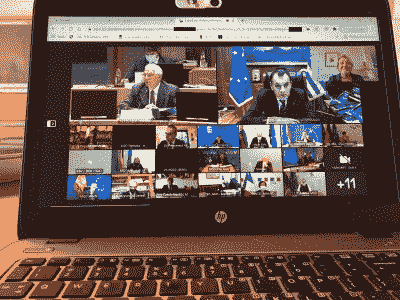

# 联合欧盟外交事务委员会

> 原文：<https://hackaday.com/2020/11/25/zoombombing-the-eu-foreign-affairs-council/>

那些有安全许可的人会犯愚蠢的错误，就像我们其他人一样。一名荷兰记者如何出现在欧盟外交事务委员会视频会议上的故事也是如此。

Netherlands Defence MInister Ank Bijleveld’s Tweeted picture, with the access details blacked out by Daniël Verlaan.

与任何其他视频通话一样，如果您有链接，就可以进入会议。因此，当荷兰国防部长 Ank Bijleveld 上周五在推特上发布一张视频通话的照片时，浏览器的地址栏向任何眼尖的人泄露了秘密。[为 RTL 广播公司工作的荷兰记者 danil ver laan 看到了屏幕上的 URL](https://twitter.com/danielverlaan/status/1329790472206888964) ,并推断出了会议的登录凭证。

我们说“推断”，但事实上 URL 中明文的 PIN 中有六个数字中的五个，留给他执行一个一位数暴力攻击并以用户名“admin”加入的困难任务。他加入并暴露了自己的存在，然后在离开前因犯有刑事罪而受到警告。

在某种程度上，这是一个以国防部长为代价的开怀大笑的机会，一旦不可避免的调查开始，我们肯定不想成为一个卑鄙的或者可能是欧盟的网络安全人士。似乎很难相信，如果没有某种形式的双因素认证(使用只有政府才能使用的硬件),这样一个高安全性会议的秘密会建立在如此不稳定的基础上。

欧盟政策不是由单个部委决定的，而是由所有 27 个国家微妙的圆桌峰会决定的。在疫情，这些已经转变为一半在网上，一半在现实生活中，所以这次欧盟国防部长会议通常有政治家和国旗的马赛克视频。和一名放大炸弹记者。